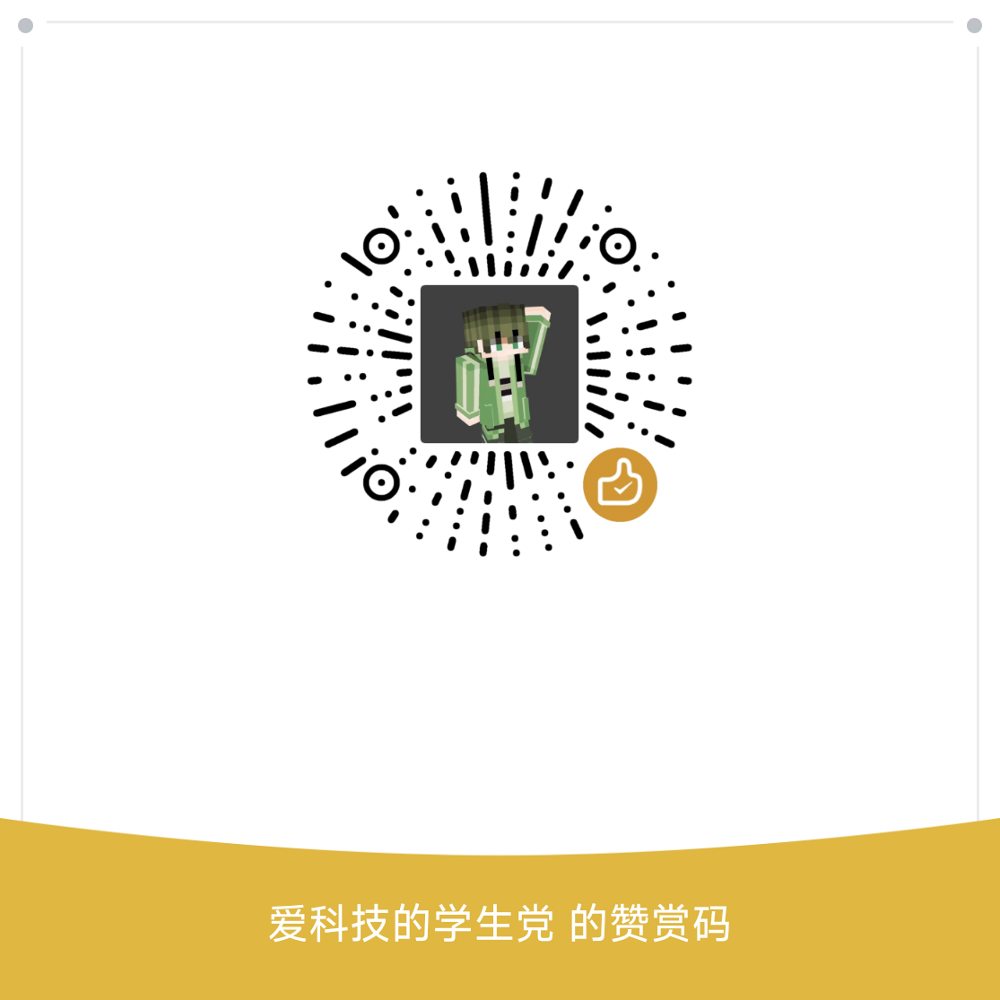

# 我的Angel Aura Amethyst (iOS) 重制版

[English](README_EN.md) | **中文** |

## 🌟 重制版核心亮点
基于官方 Amethyst 优化适配，聚焦 iOS/iPadOS 体验升级，核心特性包括：
- **Mod管理**：复刻其他启动器的Mod管理功能，支持查看Mod基本信息，一键禁用/删除Mod
- **智能下载源切换**：自动识别网络环境，在 Mojang 官方源与 BMCLAPI 之间择优选择，下载更稳定
- **完整中文本地化**：界面完整汉化，更适合中国宝宝体质 awa
- **账户限制解除**：支持本地账户、演示账户（Demo Mode）直接下载游戏，无需登录 Microsoft 账号或 Test 账号
- **多账户登录**：兼容 Microsoft 账号、本地账号及第三方验证服务器（开发中，即将上线）

> ⚠️ 说明：暂不计划重置 Android 版本（Android 端的优秀改版太多了），如需官方 Android 代码，可前往 [Amethyst-Android](https://github.com/AngelAuraMC/Amethyst-Android)。

## 🚀 快速上手指南
完整安装及设置文档可参考 [Amethyst 官方维基](https://wiki.angelauramc.dev/wiki/getting_started/INSTALL.html#ios)，或查看我的 [B站教程视频](https://b23.tv/KyxZr12)。以下为精简步骤：

### 📱 设备要求
| 类型       | 系统版本要求                | 支持机型列表                                                                 |
|------------|-----------------------------|------------------------------------------------------------------------------|
| **最低配置** | iOS 14.0 及以上             | iPhone 6s+/iPad 5代+/iPad Air 2+/iPad mini 4+/所有 iPad Pro/iPod touch 7代 |
| **推荐配置** | iOS 14.5 及以上（体验更优） | iPhone XS+（不含 XR/SE 2代）、iPad 10代+/Air 4代+/mini 6代+/iPad Pro（不含9.7英寸） |

> ⚠️ 关键提醒：iOS 14.0~14.4.2 存在严重兼容性问题，**强烈建议升级至 iOS 14.5+**；支持 iOS 17.x/iOS 18.x，但需电脑辅助配置，详情见 [官方JIT指南](https://wiki.angelauramc.dev/wiki/faq/ios/JIT.html#what-are-the-methods-to-enable-jit)。

### 🔧 侧载（Sideload）准备
优先选择支持「永久签名+自动JIT」的工具，按优先级推荐：
1. **TrollStore**（首选）：支持永久签名、自动启用 JIT、提升内存限制，适配部分 iOS 版本，下载见 [官方仓库](https://github.com/opa334/TrollStore)
2. **AltStore/SideStore**（替代）：需定期重签名，首次设置需电脑/Wi-Fi；不支持「分发证书签名服务」，仅兼容「开发证书」（需包含 `com.apple.security.get-task-allow` 权限以启用JIT）

> ⚠️ 安全提示：仅从官方/可信来源下载侧载工具及 IPA；非官方软件导致的设备问题，本人不承担责任；越狱设备虽支持永久签名，但不建议日常设备越狱。

### 📥 安装步骤
#### 1. 正式版（TrollStore 渠道）
1. 前往 [Releases](https://github.com/herbrine8403/Amethyst-iOS-MyRemastered/releases) 下载 TIPA 安装包
2. 通过系统「分享菜单」，选择用 TrollStore 打开，自动完成安装

#### 2. 正式版（AltStore/SideStore 渠道）
该渠道安装包开发中，上线后将第一时间更新。

#### 3. Nightly 测试版（每日构建）
> 🔴 风险提示：测试版可能包含崩溃、无法启动等严重漏洞，仅用于开发测试！
1. 前往 [GitHub Actions 标签页](https://github.com/herbrine8403/Amethyst-iOS-MyRemastered/actions) 下载最新 IPA 测试包
2. 在侧载工具（AltStore/SideStore 等）中导入 IPA 完成安装

### ⚡ 启用 JIT（必做！）
JIT（Just-In-Time）是流畅运行游戏的核心，iOS 需通过以下工具启用，按自身环境选择：

| 工具         | 需外部设备 | 需 Wi-Fi | 自动启用 | 备注                     |
|--------------|------------|----------|----------|--------------------------|
| TrollStore   | ❌         | ❌       | ✅       | 首选，无需额外操作       |
| AltStore     | ✅         | ✅       | ✅       | 需本地网络运行 AltServer |
| SideStore    | ✅（首次） | ✅（首次）| ❌       | 后续使用无需设备/网络    |
| StikDebug    | ✅（首次） | ✅（首次）| ✅       | 后续使用无需设备/网络    |
| Jitterbug    | ✅（VPN不可用时） | ✅ | ❌ | 需手动触发               |
| 已越狱设备   | ❌         | ❌       | ✅       | 系统级自动支持           |

## 👥 核心贡献者（官方）
Amethyst 的稳定性离不开社区团队的付出，致敬以下主要开发者：
- @crystall1nedev - [项目负责人 & iOS 移植核心]
- @khanhduytran0 - [iOS 移植核心开发者]
- @artdeell、@Mathius-Boulay、@zhuowei、@jkcoxson、@Diatrus
> 致敬传奇 artDev

## 🙏 特别感谢
- @LanRhyme - [ShardLauncher作者，提供思路和代码]

  👉 更多作品：[B站主页](https://b23.tv/3rmAFc2) | [MC移动端日志分析器](https://github.com/LanRhyme/Web-MinecraftLogAnalyzer) | [ShardLauncher iOS](https://github.com/LanRhyme/ShardLauncher-iOS)

## 📦 第三方组件及许可证
| 组件名称               | 用途                     | 许可证类型               | 项目链接                                                                 |
|------------------------|--------------------------|--------------------------|--------------------------------------------------------------------------|
| Caciocavallo           | 基础运行框架             | GNU GPLv2                | [GitHub](https://github.com/PojavLauncherTeam/caciocavallo)              |
| jsr305                 | 代码注解支持             | BSD 3-Clause             | [Google Code](https://code.google.com/p/jsr-305)                         |
| Boardwalk              | 核心功能适配             | Apache 2.0               | [GitHub](https://github.com/zhuowei/Boardwalk)                            |
| GL4ES                  | 图形渲染适配             | MIT                      | [GitHub](https://github.com/ptitSeb/gl4es)                                |
| Mesa 3D 图形库         | 3D图形渲染核心            | MIT                      | [GitLab](https://gitlab.freedesktop.org/mesa/mesa)                        |
| MetalANGLE             | Metal 图形接口适配        | BSD 2.0                  | [GitHub](https://github.com/khanhduytran0/metalangle)                     |
| MoltenVK               | Vulkan 接口转译          | Apache 2.0               | [GitHub](https://github.com/KhronosGroup/MoltenVK)                        |
| openal-soft            | 音频处理                 | LGPLv2                   | [GitHub](https://github.com/kcat/openal-soft)                            |
| Azul Zulu JDK          | Java 运行环境            | GNU GPLv2                | [官网](https://www.azul.com/downloads/?package=jdk)                       |
| LWJGL3                 | Java 游戏接口            | BSD-3                    | [GitHub](https://github.com/PojavLauncherTeam/lwjgl3)                     |
| LWJGLX                 | LWJGL2 兼容层            | 许可证未知               | [GitHub](https://github.com/PojavLauncherTeam/lwjglx)                     |
| DBNumberedSlider       | 界面滑动控件             | Apache 2.0               | [GitHub](https://github.com/khanhduytran0/DBNumberedSlider)               |
| fishhook               | 动态链接库适配           | BSD-3                    | [GitHub](https://github.com/khanhduytran0/fishhook)                       |
| shaderc                | Vulkan 着色器编译        | Apache 2.0               | [GitHub](https://github.com/khanhduytran0/shaderc)                        |
| NRFileManager          | 文件管理工具类           | MPL-2.0                  | [GitHub](https://github.com/mozilla-mobile/firefox-ios)                   |
| AltKit                 | AltStore 适配支持        | -                        | [GitHub](https://github.com/rileytestut/AltKit)                           |
| UnzipKit               | 解压工具                 | BSD-2                    | [GitHub](https://github.com/abbeycode/UnzipKit)                           |
| DyldDeNeuralyzer       | 库验证绕过工具           | -                        | [GitHub](https://github.com/xpn/DyldDeNeuralyzer)                         |
> 额外感谢：[MCHeads](https://mc-heads.net) 提供 Minecraft 头像服务

## 捐赠

如果您觉得这个项目对您有帮助，欢迎通过以下二维码进行捐赠支持：

